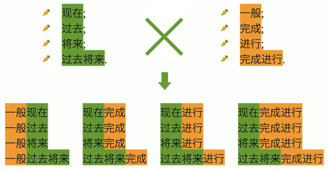

这个markmap好像不太行，后边抽时间再想想办法。
[思维导图](http://naotu.baidu.com/file/2abbe965ad3d97b485d4c199db5f3900?token=48240a4a6d6f0171)
<!-- more -->
````markmap
---
markmap:
  colorFreezeLevel: 2
---
# 英语语法

## 简单句

### 最简单的句子：什么+怎么样

英语句子拆分成简单句后，粗略地分一共就只有两部分：
> 什么 + 怎么样

其对应的句子成分为：
> 主语 + 谓语

####  

注意：谓语≥谓语动词

- 句子主语后面余下的句子就是谓语。谓语动词只是谓语的一部分。

##### 可以独立完成的动作（没有动作承受者）

> 例句：Papa Rabbit sleeps.

##### 有1个动作承受者

> 例句：Papa Rabbit likes you.

##### 有2个动作承受者

> 例句：Papa Rabbit teaches you English.

- `teaches`是`双及物动词`
- `you`是`间接宾语`
- `English`是`直接宾语`

##### 只有一个动作承受者（但需要补充）

> 例句：Papa Rabbit considers you smart.

- `considers` 是`复杂及物动词`
- `you` 是`宾语`
- `smart` 是`(宾语)补语`

##### 非“动作”

> 例句：Papa Rabbit is tall.

`is`这类词的作用就是把这个词后面的信息赋予给前面的词，也就是连系其前后，类似于：
> Papa Rabbit ← tall.

像这样的赋予主语某种特征或状态的，“划等号”的词，称之为`连系动词`简称`系动词`(linking verbs)，而系动词后面的补充信息也就是`(主语)补语`——中国也称其为`表语`。

### 基本句型

注：还有一种“八大句型”的分类，即在“五大句型”基础上增加：

6. “there be”句型，如：There is a rabbit. 可理解为第五种句型“主语+系动词+表语”的倒装形式。
7. 主语+谓语动词+状语，如：I live in China. 可理解为第一种句型“主语+谓语动词”的延伸（虽然这里的状语很重要）。
8. 主语+谓语动词+宾语+状语，如：I put the crrot on the table. 可理解为第四种句型的“主语+谓语动词+宾语+宾语补语”延伸。

### (简单句)句子成分

这里主要说的是`简单句`的句子成分。

#### 主语

#### 谓语动词

#### 宾语

#### 宾语补语

#### 主语补语(表语)

#### 定语

主要用来修饰主语和宾语，如：`The little white` rabbit ate `a large` carrot.

- `The little white`是主语`rabbit`的定语。
- `a large`是宾语`carrot`的定语。

#### 状语

主要用来修饰谓语动词，如：The rabbit ate `quickly`.

- `quickly`就是`ate`的状语

#### 同位语

主要用来再把`主语`或`宾语`说一遍。如：Papa Rabbit, `an English teacher`, eats carrots.

## 复合句/并列(复合)句

把简单句叠加起来组成的句子。

## 复杂句/主从(复合)句

由简单句相互嵌套组成的句子。

### 主句

### 从句

从句说白了就是把`简单句`修改下来充当另一个句子的句子成分。

从句可以充当所有除了谓语动词外的句子成分。

#### 名词性从句

##### 主语从句

##### 宾语从句

##### 表语从句

##### 同位语从句

#### 定语从句

#### 状语从句

## 词性(词类)

### 名词

### 动词

英语语法的核心。

#### 谓语动词

##### 三大本领

###### 时态 

####### ①动作时间

######## 现在

######## 过去

######## 将来

######## 过去将来

####### ②动作状态

######## 一般

######## 完成

######## 进行

######## 完成进行

###### 语气

这里的语气不是说话时的语气（口气），是语法的语气。

####### ③动作假设，情感...

######## 虚拟语气

######## 陈述语气

######## 祈使语气

##### 分类

###### 主动词

####### 实义动词

######## 及物动词

######### ①单及物动词

######### ②双及物动词

######### ③复杂及物动词

######## ④不及物动词

####### ⑤系动词

###### 助动词

与主动词一起使用，帮助主动词完成表达各种`时态`、`语态`、`语气`及`否定`和`疑问`等任务。

####### 构成时态的助动词

######## be动词

######### am

######### is

######### are

######### was

######### were

######## have/has/had

####### 构成疑问和否定的助动词

######## do/does/did

####### 情态动词

######## can/could

######## may/might

######## shall

######## will/would

######## should

######## ought to

######## need

######## dare

#### 非谓语动词

**`非谓语动词`几乎可以取代所有的从句，从而简化句子。**

比如作主语、宾语、宾语补语、主语补语、定语等。

##### 动词不定式

##### 现在分词

##### 动名词

##### 过去分词

### 冠词

### 代词

### 形容词

### 副词

### 数词

### 介词

### (感)叹词

### 连词

````