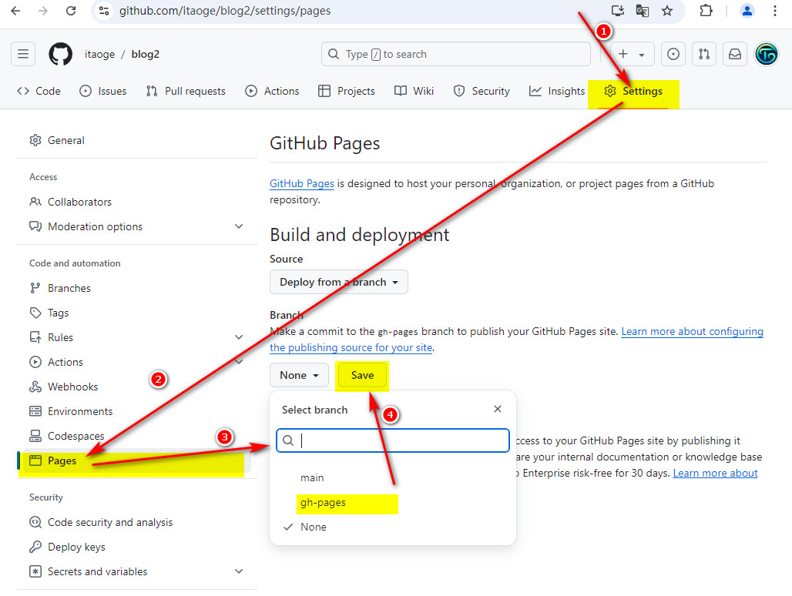
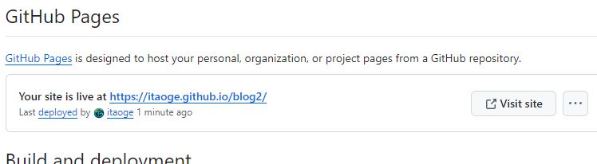

本文介绍通过 [VuePress](https://vuepress.vuejs.org/zh/) + GitHub Pages 搭建自己的静态博客站的流程，这里使用的是Vuepress的[hope主题](https://theme-hope.vuejs.press/zh/)。
<!-- more -->
> [!tip]
> 开始前你得装好nodejs、git、npm（或者pnpm、yarn），并且注册好github账号。

## 一. 创建项目
1. 在github上创建一个仓库，名称随意，这里我创建了一个叫`blog2`的仓库`(注意：为了方便，我们只创建空仓库——不要创建README文件，否则牵扯到git合并，小白会比较麻烦)`。
2. 在本地创建一个文件夹（最好英文名），并进入该文件夹，执行如下命令：
```bash
npm init vuepress-theme-hope@latest blog2
```
> [!tip]
> 我这里测试用，所以用的是`blog2`，实际使用中请修改成自己的想要的文件夹名字。

- 运行命令后选择中文（如果你英文不错可以选择English）
- 包管理器选你想用的，我这里选择`npm`
- 打包器选你想用的，我选的是`Vite`
- 应用名称随意，这里我写的是`blog2`
- 应用描述随意，这里我写的是`我的博客`
- 版本号随意，这里我写的是`1.0.0`
- 协议随意，这里我直接回车用默认
- 想要创建的项目类型选`blog`
- 项目多语言与否看你自己的情况，我这里输入`n`
- 是否初始化Git仓库，我这里输入`y`
- 是否需要一个自动部署文档到GitHubPages的工作流，输入`y`
- 镜像选国内镜像
- 是否现在启动demo查看，输入`y`

命令执行完后，会在本地生成一个名为`blog2`的文件夹，里面已经包含了一个VuePress项目，我们只需要在里面修改一下配置，就可以搭建自己的静态站博客了。
## 二. 配置项目
3. 进入`blog2`文件夹，使用git执行如下命令：
```bash
git remote add origin https://github.com/your_username/blog2.git
```
> [!tip]
> 请把`your_username`替换成你的github用户名。把`blog2`替换成你的仓库名。
> 这条命令的作用是将本地仓库与远程仓库关联，这样就可以将本地仓库的内容推送到远程仓库。

4. 依次执行如下git命令：
```bash
git add .
git commit -m "first commit"
git branch -M main
git push -u origin main
```
> [!tip]
> 上面的命令是将本地仓库的修改推送到远程仓库，可能会弹出个对话框来需要输入你的github账号的密码，如果你的github账号设置了两步验证，需要输入验证码等。

5. 进入你的github仓库，可以看到你的项目里的代码已经有了。
6. 稍等一会（大约1~2分钟），或者进入仓库的`Actions`页面看看，有个正在执行的工作流，等它执行完后，就可以看到你的项目多了一个分支`gh-pages`，这就是你的静态站博客的源码了。
> [!tip]
> 也就是说，我们只需要在本地修改代码，然后推送到远程仓库（main分支），**GitHub Actions就会自动帮我们生成静态站博客的源码，然后自动部署到`gh-pages`分支**。下面我们通过操作为gh-pages分支配置域名来访问我们的静态站博客。

## 三. 部署博客地址
7. 回到你的github仓库的主页，点击`Settings`，找到`Pages`，下面我们将要设置开通pages地址。如下图：


> [!tip]
> 注意： 选择`gh-pages`分支，然后点击`Save`按钮。 稍等几分钟，刷新页面就可以看到你的静态站博客的网址了。如图：


## 四. 配置base路径
8. 打开那个地址，你会看到你得博客了。但是看起来有些乱，这是因为我们的博客处在一个二级目录`blog2`下，所以我们需要配置下`.vuepress/config.js`文件，将`base`配置成`"/blog2/"`。
```ts
export default defineUserConfig({
  base: "/blog2/", 
  // 其他配置项
}
```
9. 保存后，将代码同步到仓库（当然你也可以在线上直接改，直接提交代码，这里就不演示了）。等待一会，让GitHub自动部署完，刷新页面，你会看到你的博客首页已经正常显示了。

## 五. 结语
至此，我们已经成功搭建了自己的静态博客站，并通过GitHub Pages部署了我们的静态站博客。当然，你还可以继续完善博客的主题、内容、功能，让它更加完美。具体使用方法请参考[VuePress官方文档](https://vuepress.vuejs.org/zh/)以及[hope主题](https://theme-hope.vuejs.press/zh/)的文档。

